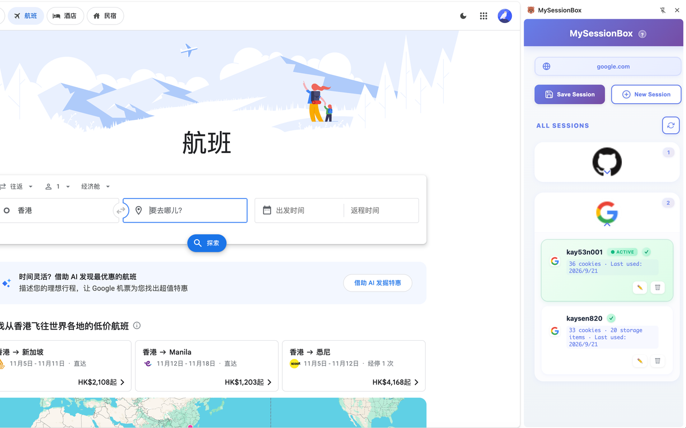

# MySessionBox

MySessionBox 是一个浏览器扩展，用来在同一个网站保存并切换多个登录会话。会话数据只存在你的浏览器本地，不会上传到服务器。

适合需要在同一站点来回切换账号的开发、测试和日常使用。



## 功能

- 保存当前网站的登录会话（Cookie 和本地存储）
- 一键切换已保存的会话，无需反复登录退出
- 按网站分别管理多个账号
- 检查会话是否仍然有效
- 缓存网站图标，打开扩展时更快
- Chrome 使用侧边栏，Firefox 使用弹窗

## 安装

构建需要 [Bun](https://bun.sh)。

```bash
bun install
bun run build:chrome    # 或 bun run build:firefox
```

**Chrome / Edge**

1. 打开 `chrome://extensions/`
2. 打开开发者模式
3. 加载已解压的扩展程序，选择 `dist/` 目录

**Firefox**

1. 打开 `about:debugging`
2. 此 Firefox → 临时载入附加组件
3. 选择 `dist/manifest.json`

## 隐私

所有会话都只保存在本地。隐私政策见 [privacy-policy.md](privacy-policy.md)。
